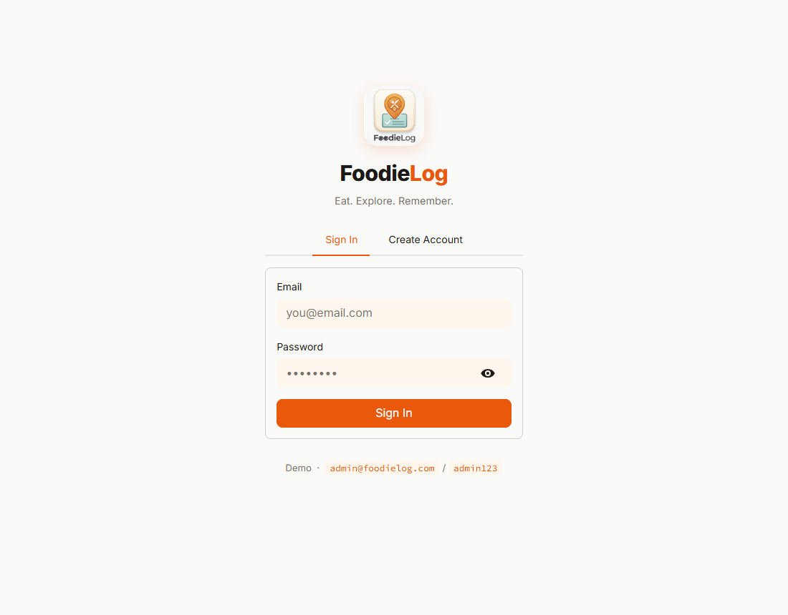
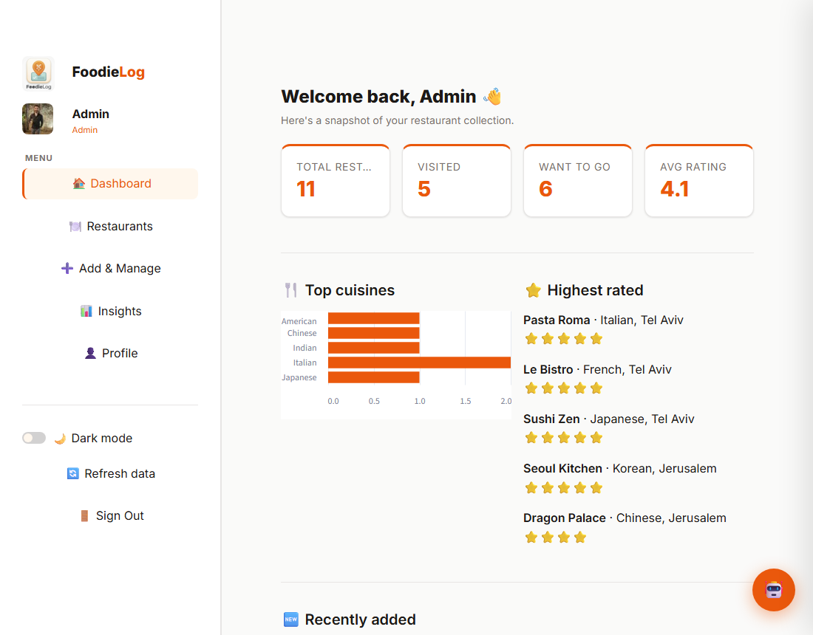
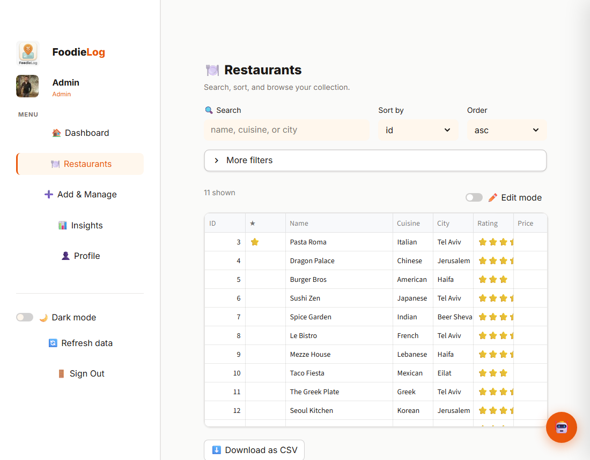
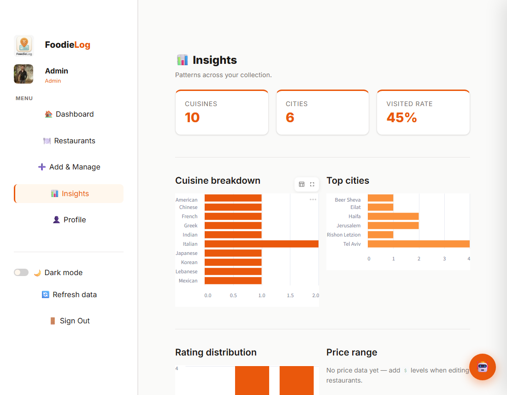
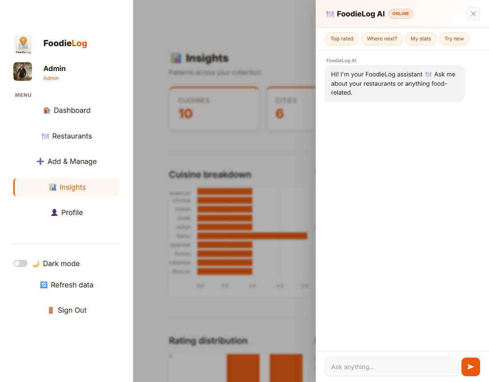

# FoodieLog 🍽️

A personal restaurant tracker: keep a wishlist of places you want to eat at, rate the ones you've already tried, and manage everything from a **Streamlit** dashboard wired to a **FastAPI** backend. Each account has its own private collection, secured with JWT auth, plus an async refresh worker, Redis-backed rate limiting, pagination with ETag caching, and a built-in AI assistant.

## Screenshots

### Login & Create Account



### Dashboard



### Restaurants — search, sort, inline edit



### Insights



### AI Assistant



---

## Stack

| Layer | Details |
|---|---|
| **Frontend** | `frontend/dashboard.py` — Streamlit dashboard with login/registration, a sectioned sidebar (Dashboard · Restaurants · Add & Manage · Insights · Profile), dark mode, and a floating AI chat widget. |
| **Backend** | `app/` — **FastAPI**, **SQLModel**, **Uvicorn**; tables auto-create on startup. |
| **Database** | **SQLite** via SQLModel — `users` and `restaurants` tables in `data/foodie.db`. |
| **Cache & limits** | **Redis** — per-IP rate-limit middleware and idempotency keys for the refresh worker; fails open when Redis is down. |
| **Auth** | **JWT** (`pyjwt`) + **bcrypt** (`passlib`). DB-backed register/login, per-user ownership, role-aware deletes. |
| **AI** | **Groq** (OpenAI-compatible client) — Llama 3.3 70B, grounded in the signed-in user's own collection. |
| **Worker** | **arq** — scheduled background refresh job. |

## Requirements

- Python 3.12+
- [`uv`](https://docs.astral.sh/uv/) — `pip install uv`
- *(optional)* Redis — enables rate limiting and the refresh worker
- *(optional)* a free [Groq API key](https://console.groq.com) — enables the AI assistant

## Quick start

```bash
git clone https://github.com/EASS-HIT-PART-A-2026-CLASS-IX/FoodieLog
cd FoodieLog
uv sync
cp .env.example .env    # then add FOODIE_GROQ_API_KEY if you want the AI assistant
```

Start the backend:

```bash
uv run uvicorn app.main:app --reload
```

Start the frontend in a second terminal:

```bash
uv run streamlit run frontend/dashboard.py
```

- **Dashboard:** [http://localhost:8501](http://localhost:8501)
- **API docs (Swagger):** [http://localhost:8000/docs](http://localhost:8000/docs)

### Demo accounts (seeded on first run)

| Email | Password | Role |
|---|---|---|
| `admin@foodielog.com` | `admin123` | admin |
| `demo@foodielog.com` | `demo123` | user |

Or register your own from the **Create Account** tab.

## Docker Compose

Brings up four services — API, Redis, the arq worker, and the Streamlit frontend:

```bash
cp .env.example .env
docker compose up --build
```

## Default ports

| Service | Port |
|---|---|
| Frontend (Streamlit) | 8501 |
| Backend (Uvicorn) | 8000 |
| Redis | 6379 |

## Environment

Copy `.env.example` to `.env` and adjust as needed:

| Variable | Required | Description |
|---|---|---|
| `FOODIE_JWT_SECRET` | recommended | JWT signing key — generate with `python -c "import secrets; print(secrets.token_hex(32))"` |
| `FOODIE_GROQ_API_KEY` | for AI | Groq key from [console.groq.com](https://console.groq.com); the assistant is disabled without it |
| `FOODIE_DATABASE_URL` | no | Defaults to `sqlite:///./data/foodie.db` |
| `FOODIE_REDIS_URL` | no | Defaults to `redis://localhost:6379/0`; the app runs without Redis |
| `FOODIE_RATE_LIMIT_PER_MINUTE` | no | `0` disables limiting (local default); `compose.yaml` sets `20` |
| `FOODIE_JWT_EXPIRY_MINUTES` | no | Access-token lifetime — default `30` |
| `FOODIE_GROQ_MODEL` | no | Groq model id — default `llama-3.3-70b-versatile` |
| `FOODIE_REFRESH_USER_EMAIL` / `_PASSWORD` | no | Account the refresh worker logs in as (default demo admin) |

> **Security:** never commit `.env` or real secrets.

## Features

### Accounts & per-user data (`app/routers/auth.py`)

Register and log in with email + password; passwords are bcrypt-hashed and stored in a `users` table. Tokens are JWTs carrying `sub`, `iat`, `exp`, `iss`, `aud`, and `roles`. Every restaurant is tagged with an `owner_id`, so each user only ever sees and edits their own list. Display name and password are editable from the Profile page.

**Endpoints:** `POST /auth/register`, `POST /auth/login`, `POST /auth/token`, `GET/PATCH /auth/me`

### Restaurant tracking (`app/routers/` + `app/repository.py`)

Full CRUD over restaurants, each with name, cuisine, city, rating (1–5), status (Want to Go / Visited), an optional price level ($–$$$$), free-form tags, notes, and a favorite flag. The Restaurants tab supports an inline-editable grid; deletes are owner-only (admins can remove any).

**Endpoints:** `GET/POST /restaurants`, `GET/PUT/DELETE /restaurants/{id}`

### Search, sort & pagination + ETag (`app/pagination.py`)

`GET /restaurants` takes `search` (name/cuisine/city/tags), `sort_by`, `order`, `page`, and `page_size` (1–100). Responses carry `X-Total-Count` / `X-Total-Pages` headers and a weak `ETag`; a matching `If-None-Match` returns `304 Not Modified`.

### Rate limiting (`app/rate_limit.py`)

Redis-backed middleware counts requests per client IP and path, returns `429` past the limit, and adds `X-RateLimit-Limit` / `X-RateLimit-Remaining` to every response. Disabled by default locally; enabled in Compose.

### Async refresh worker (`scripts/refresh.py`, `app/worker.py`)

A Typer CLI that fans out concurrent status refreshes using `asyncio.Semaphore` for bounded concurrency, `tenacity` exponential-jitter retries, and Redis idempotency keys (1-hour TTL) to skip already-processed entries. It authenticates first, then carries `X-Trace-Id` and `Idempotency-Key` on each call. An arq cron worker runs the same job four times a day.

```bash
uv run python scripts/refresh.py run --limit 5
```

### AI assistant (`app/routers/ai.py`, `frontend/_ai_widget.py`)

A floating chat button (bottom-right) opens a side drawer. The backend summarizes your collection into context and asks Groq your question — works for both "what's my best-rated Italian place?" and general food questions. It can also suggest a brand-new restaurant to add with one click.

**Endpoints:** `POST /ai/chat`, `POST /ai/recommend`

## API (full list)

| Method | Path | Auth | Description |
|---|---|---|---|
| POST | `/auth/register` | — | Create an account, returns a JWT |
| POST | `/auth/login` | — | Email + password login, returns JWT + user |
| POST | `/auth/token` | — | OAuth2 form login for Swagger's Authorize |
| GET / PATCH | `/auth/me` | JWT | Read / update name and password |
| GET | `/health` | — | Service health probe |
| GET | `/restaurants` | JWT | List your own — paginated, searchable, sortable, ETag-cached |
| POST | `/restaurants` | JWT | Create a restaurant (owned by you) |
| GET | `/restaurants/{id}` | JWT | Fetch one of your restaurants |
| PUT | `/restaurants/{id}` | JWT | Update one of your restaurants |
| DELETE | `/restaurants/{id}` | JWT | Delete (owner; admin may delete any) |
| POST | `/ai/chat` | JWT | Ask the AI assistant |
| POST | `/ai/recommend` | JWT | Get a new restaurant suggestion |

Interactive docs live at `/docs` (Swagger UI) while the API runs.

## Development

- **Backend:** Uvicorn with `--reload` applies changes instantly.
- **Frontend:** Streamlit hot-reloads on save.
- **Tests:** each backend test runs against a fresh temporary SQLite database, so `data/foodie.db` is never touched. Frontend client tests mock `httpx`, so no live server is needed.

```bash
uv run pytest tests/ -v
```

34 tests across five suites — CRUD & search, registration/login/ownership/expiry, pagination & ETag, async-refresh (anyio + ASGI transport), and the frontend client.

## Repository layout

```
FoodieLog/
├── compose.yaml              # API + Redis + worker + frontend
├── Dockerfile                # shared image
├── .env.example              # copy to .env
├── README.md
├── app/
│   ├── main.py               # FastAPI app, middleware, lifespan
│   ├── models.py             # SQLModel tables + Pydantic schemas
│   ├── repository.py         # data access: pagination, search, sort
│   ├── security.py           # bcrypt hashing + JWT creation
│   ├── config.py             # env-driven settings
│   ├── database.py           # engine, session, seeding + auto-migration
│   ├── dependencies.py       # FastAPI dependency wiring
│   ├── cache.py              # async Redis client
│   ├── rate_limit.py         # per-IP rate-limit middleware
│   ├── pagination.py         # page params + ETag helpers
│   ├── worker.py             # arq worker settings + cron
│   └── routers/
│       ├── auth.py           # register / login / token / me
│       └── ai.py             # chat + recommend (Groq)
├── frontend/
│   ├── dashboard.py          # Streamlit app (login + sections)
│   ├── client.py             # httpx API client
│   └── _ai_widget.py         # floating AI chat drawer
├── scripts/
│   ├── refresh.py            # async refresh CLI
│   └── demo.sh               # end-to-end API walkthrough
├── docs/
│   └── screenshots/          # README images
└── tests/                    # pytest suite (34 tests)
    ├── conftest.py
    ├── test_restaurants.py
    ├── test_auth.py
    ├── test_pagination.py
    ├── test_refresh.py
    └── test_client.py
```

## AI Assistance

This project was built with the help of **Claude Code** (Anthropic) as a pair-programming assistant — scaffolding routers, models, and tests, then adapting them to the restaurant domain. Every generated change was run and reviewed locally before committing: the full test suite must pass, the Docker stack must start cleanly, and `scripts/demo.sh` must run end-to-end.
